# Mercado de trabalho brasileiro — PNAD Contínua 2025–2026

Análise quantitativa do mercado de trabalho brasileiro com microdados da
PNAD Contínua trimestral. O projeto cobre todos os trimestres de 2025 e o
primeiro trimestre de 2026, com foco em desigualdades regionais, de gênero
e raça, retorno educacional e determinantes da participação na força de trabalho.

---

## Estrutura do projeto
pnad/
├── 00_config.R          # Configuração global: caminhos, paleta, tema
├── 01_download.R        # Download dos microdados via PNADcIBGE
├── 02_process.R         # Tratamento e construção de variáveis
├── 03_indicators.R      # Indicadores ponderados por corte temático
├── 04_visualizations.R  # Gráficos temáticos
├── 05_maps.R            # Mapas coropléticos por UF
├── 06_tables.R          # Tabelas editoriais via gt
├── 07_logit.R           # Modelo logit de participação na força de trabalho
├── run_all.R            # Executa o pipeline completo
├── renv.lock            # Versões dos pacotes (reprodutibilidade)
└── data/
└── raw/             # Microdados brutos — não versionados

---

## Dados

**Fonte:** PNAD Contínua / IBGE
**Período:** 1º trimestre de 2025 a 1º trimestre de 2026 (5 trimestres)
**Acesso:** microdados públicos via pacote PNADcIBGE
**Pesos:** estimativas calculadas com peso amostral V1028

Os microdados brutos não estão versionados por serem volumosos e de
redistribuição restrita. Para reproduzir o projeto, execute run_all.R
a partir de uma sessão R com o pacote PNADcIBGE instalado.

---

## Metodologia

### Indicadores de mercado de trabalho

Calculados com weighted.mean() e somas ponderadas (V1028).

| Indicador | Definição |
|---|---|
| Taxa de desocupação | Desocupados / Força de trabalho |
| Taxa de participação | Força de trabalho / PIT (14+) |
| Taxa de ocupação | Ocupados / PIT (14+) |
| Rendimento médio | Média ponderada de VD4020 |
| Rendimento por hora | Rendimento / (horas semanais × 4,345) |

### Escolaridade agregada

| Grupo | Códigos VD3005 |
|---|---|
| Até fundamental incompleto | 00–04 |
| Fundamental completo / médio incompleto | 05–07 |
| Médio completo / superior incompleto | 08–09 |
| Superior completo | 10–16 |

### Modelo logit

Variável dependente: participação na força de trabalho (1 = participa).
Amostra: PIT com 18+ anos, poolado 2025–2026.
Covariadas: sexo, raça/cor, escolaridade, idade, idade², área urbana,
macrorregião e trimestre.

Estimação via glm() com pesos normalizados (V1028 / média(V1028)).
Intervalos de confiança de Wald. Efeitos marginais médios aproximados
calculados na média da amostra.

---

## Reprodutibilidade

Para reproduzir o projeto:

1. Clone o repositório
2. Abra o projeto no RStudio
3. Restaure os pacotes com renv::restore()
4. Execute o pipeline com source("run_all.R")

Tempo estimado: 20–40 minutos dependendo da velocidade de download.

---

## Pacotes principais

| Pacote | Uso |
|---|---|
| PNADcIBGE | Download dos microdados |
| dplyr / tidyr | Manipulação de dados |
| ggplot2 | Visualizações |
| geobr | Geometrias das UFs brasileiras |
| sf | Manipulação de dados espaciais |
| classInt | Quebras de Jenks para mapas |
| gt / gtExtras | Tabelas editoriais |
| broom | Organização de resultados do modelo |
| showtext | Tipografia IBM Plex nos gráficos |
| patchwork | Composição de painéis |

---

## Principais resultados

### Evolução da desocupação — Brasil
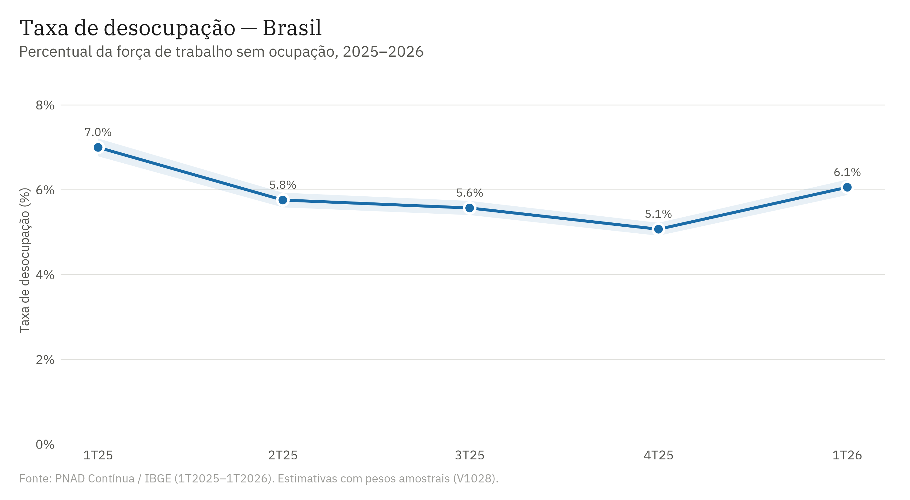

### Desigualdade de gênero e raça
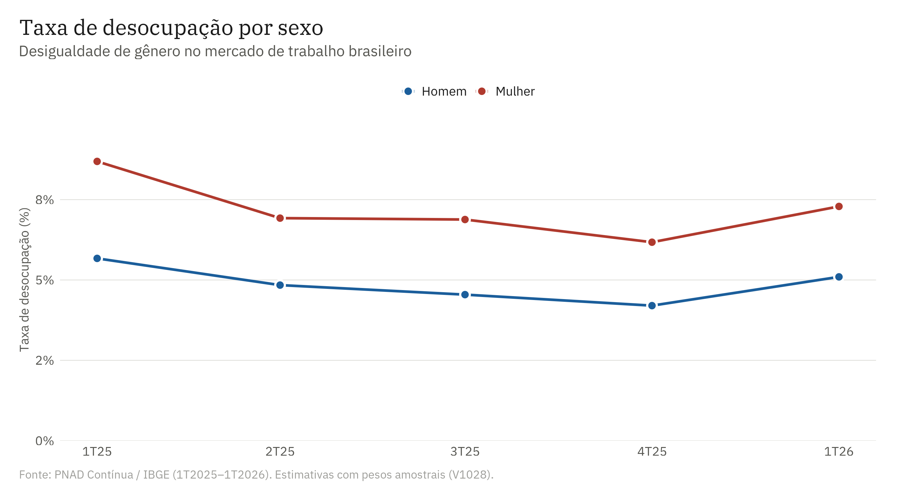
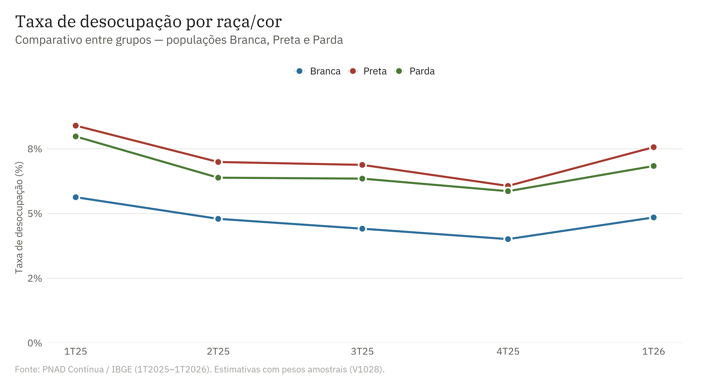

### Rendimento e escolaridade
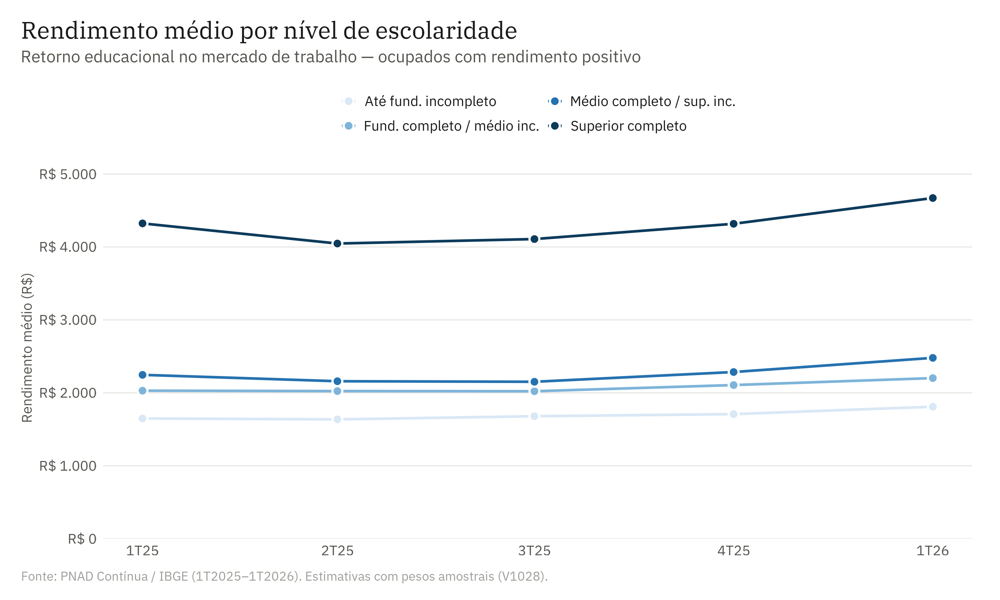

### Ranking regional
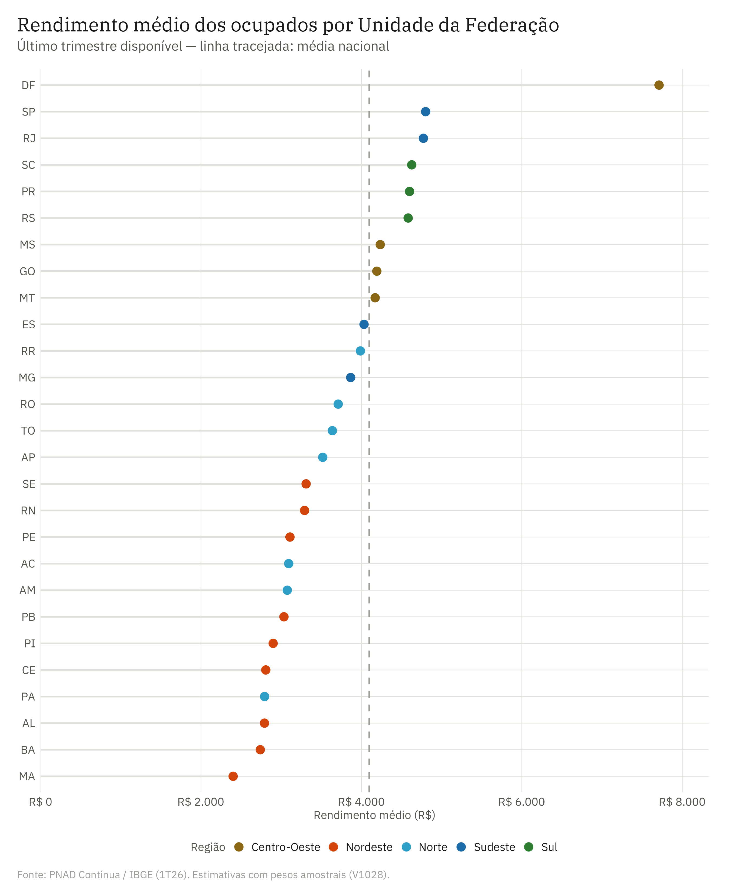

### Desigualdade de gênero no mercado de trabalho
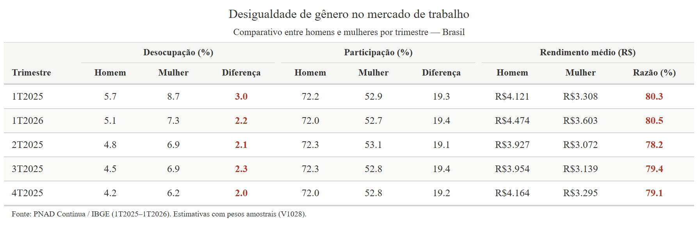

### Mapas regionais
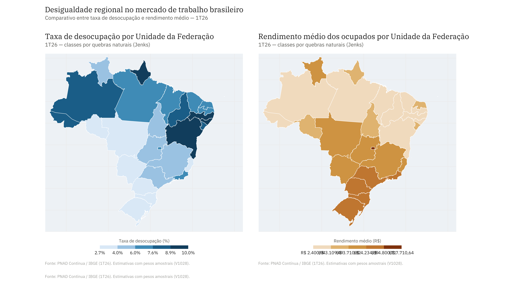
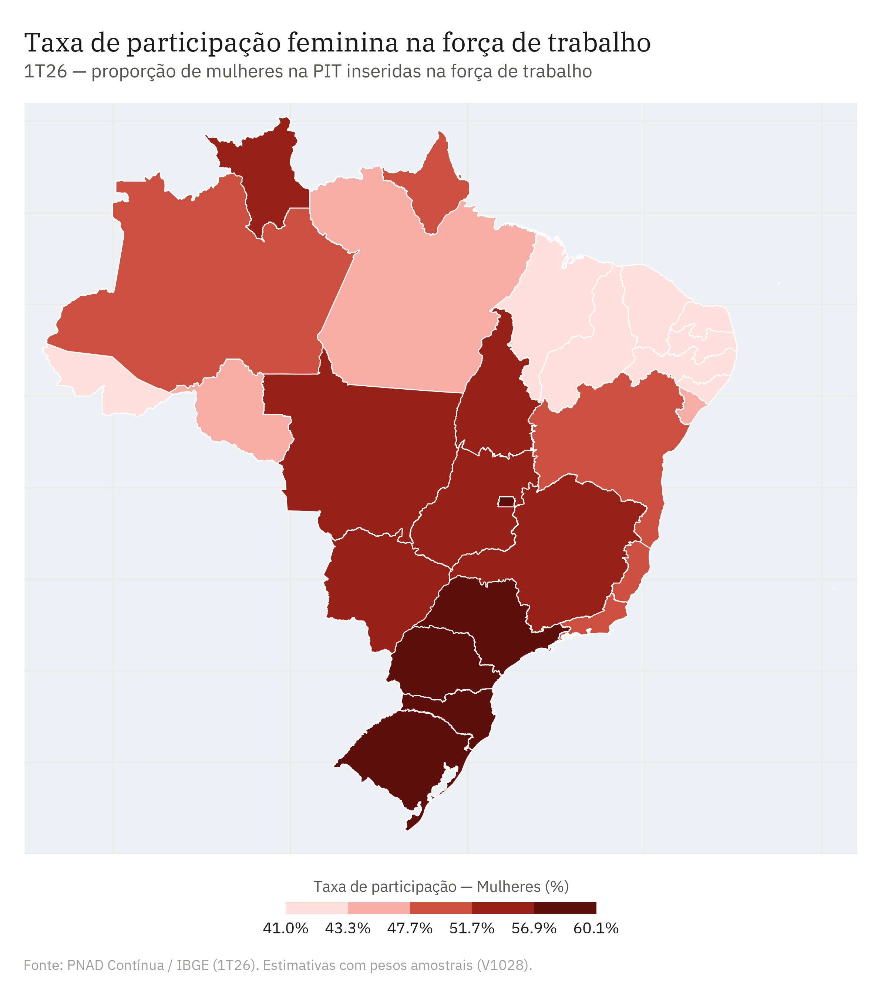

### Modelo logit — participação na força de trabalho
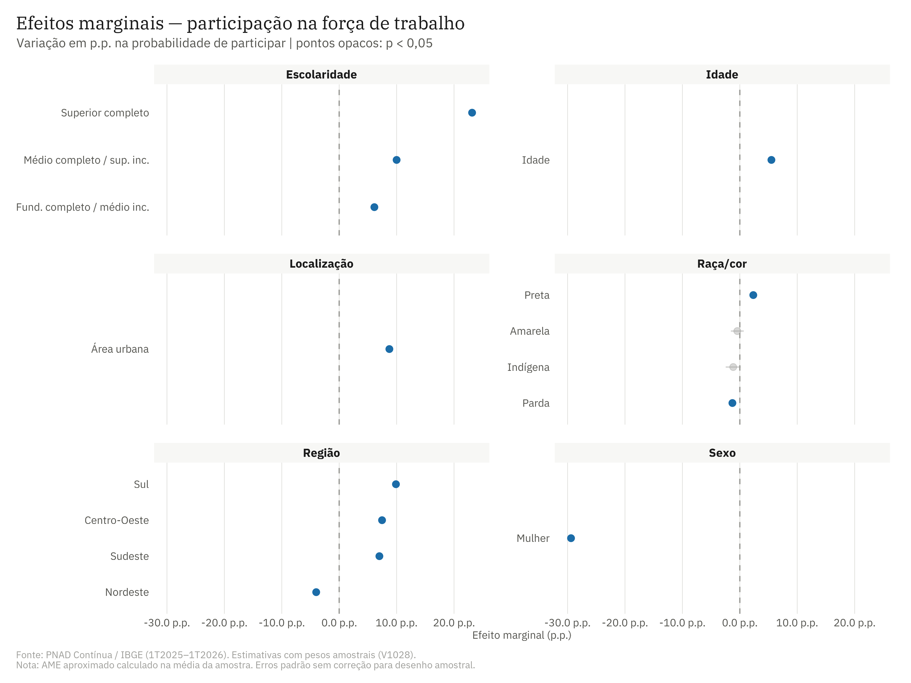
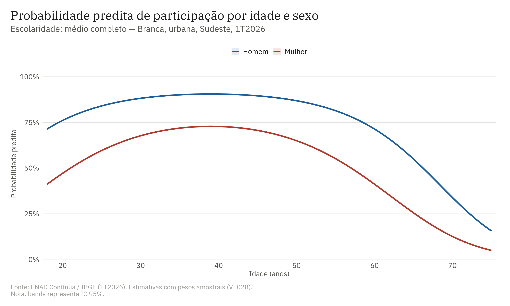

### Ranking de UFs
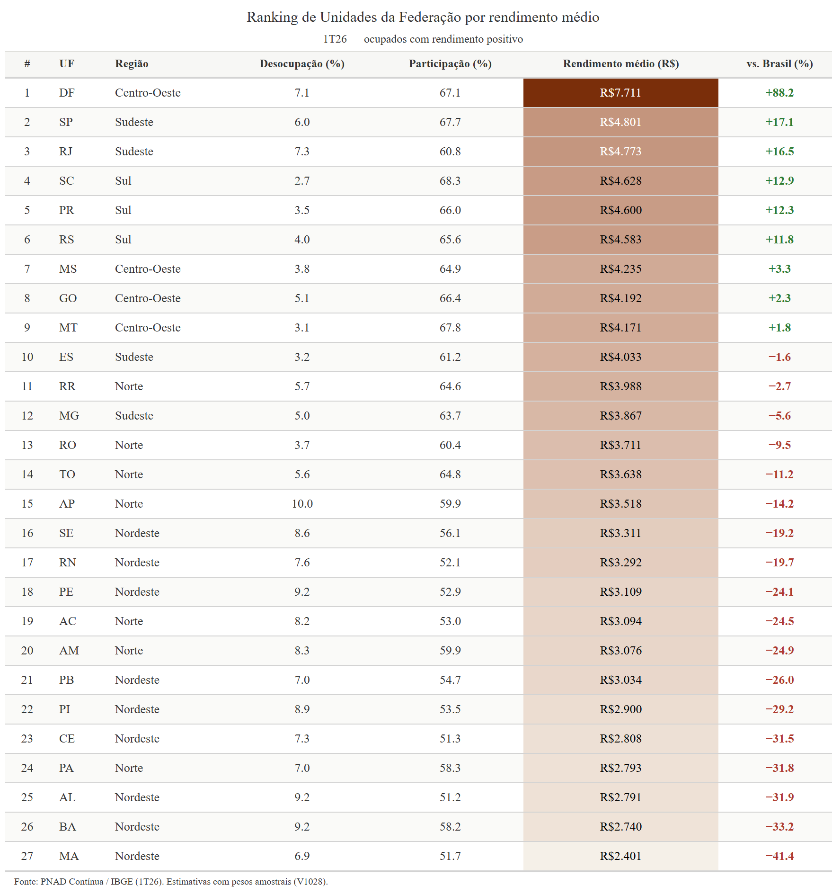

## Autora

Carolina Freitas
