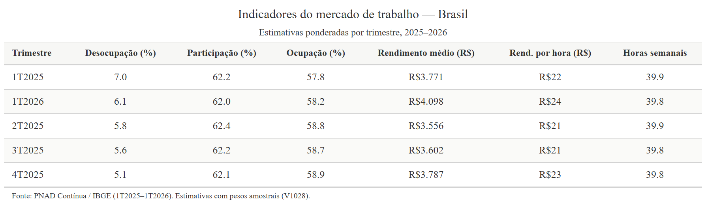
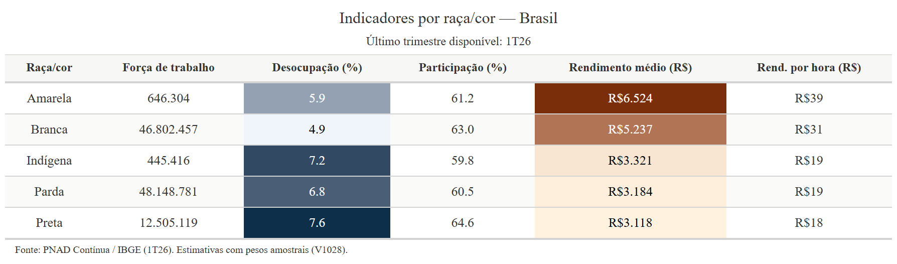
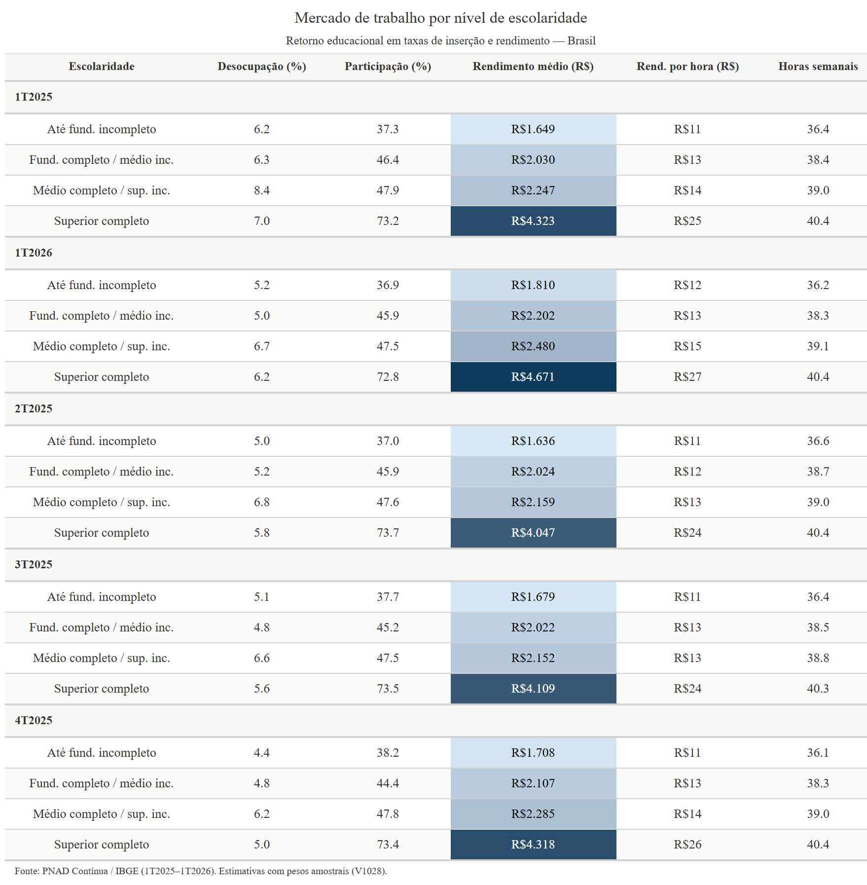
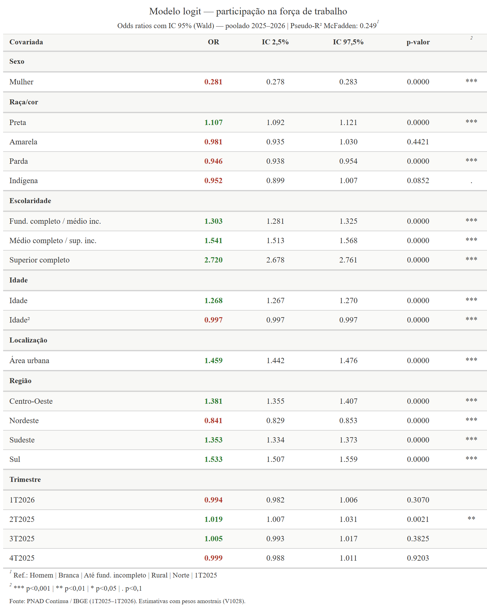
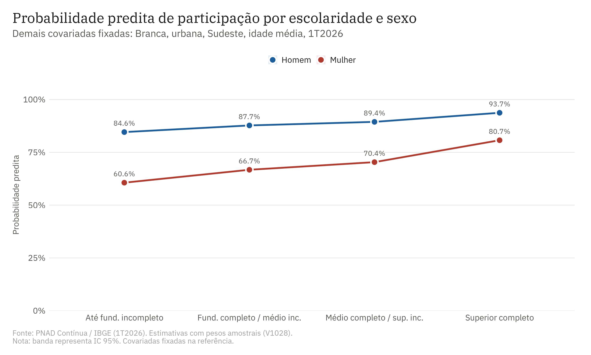

# Brazilian Labour Market / Mercado de trabalho brasileiro
## PNAD Contínua 2025–2026

## Table of Contents / Sumário

### 🇬🇧 English
- [Project structure](#project-structure)
- [Data](#data)
- [Methodology](#methodology)
- [Main results](#main-results)
- [Generated outputs](#generated-outputs)
- [Reproducibility](#reproducibility)
- [Packages and citations](#packages-and-citations)
- [References](#references)
- [Tools](#tools)
- [Author](#author)

### 🇧🇷 Português
- [Estrutura do projeto](#estrutura-do-projeto)
- [Dados](#dados)
- [Metodologia](#metodologia)
- [Principais resultados](#principais-resultados)
- [Outputs gerados](#outputs-gerados)
- [Reprodutibilidade](#reprodutibilidade)
- [Pacotes utilizados e citações](#pacotes-utilizados-e-citações)
- [Referências](#referências)
- [Autora](#autora)

---


# Brazilian Labour Market — PNAD Contínua 2025–2026

Quantitative analysis of the Brazilian labour market using microdata from the PNAD Contínua quarterly household survey (2025Q1–2026Q1).

## Project structure

```
pnad/
├── 00_config.R          # Global settings: paths, colour palette, ggplot2 theme
├── 01_download.R        # Automated microdata download via PNADcIBGE
├── 02_process.R         # Data cleaning, labels and derived variables
├── 03_indicators.R      # Weighted indicators by analytical group
├── 04_visualizations.R  # Thematic charts with editorial theme
├── 05_maps.R            # Choropleth maps by state (Jenks breaks)
├── 06_tables.R          # Analytical tables via gt
├── 07_logit.R           # Logit model of labour force participation
├── run_all.R            # Runs the full pipeline in sequence
├── renv.lock            # Package versions for reproducibility
└── data/
    └── raw/             # Raw microdata — not versioned
```

---

## Data

**Source:** Pesquisa Nacional por Amostra de Domicílios Contínua (PNAD Contínua) — IBGE
**Period:** 1st quarter of 2025 to 1st quarter of 2026 (5 quarters)
**Access:** Public microdata via the [`PNADcIBGE`](https://github.com/Gabriel-Assuncao/PNADcIBGE) package
**Weighting:** All estimates use the sampling weight V1028

### Variables used

| Code | Description |
|------|-------------|
| V1028 | Sampling weight |
| V2007 | Sex |
| V2009 | Age |
| V2010 | Race/colour |
| VD3005 | Educational attainment (16 categories) |
| VD4001 | Labour force status |
| VD4002 | Employment status |
| VD4020 | Effective earnings from all jobs |
| VD4031 | Usual weekly hours worked |
| V1022 | Urban/rural situation |
| UF | State (Unidade da Federação) |

### Aggregated education variable

The variable `VD3005` (16 categories) was recoded into 4 analytical groups:

| Group | VD3005 codes | Description |
|-------|-------------|-------------|
| 1 | 00–04 | Less than primary complete |
| 2 | 05–07 | Primary complete or lower secondary incomplete |
| 3 | 08–09 | Upper secondary complete or tertiary incomplete |
| 4 | 10–16 | Tertiary complete |

---

## Methodology

### Labour market indicators

Indicators are calculated using the sampling weight V1028 via `weighted.mean()` and weighted sums. The Working-Age Population (WAP) is defined as individuals aged 14 or over.

| Indicator | Definition |
|-----------|------------|
| Unemployment rate | Unemployed / Labour force × 100 |
| Participation rate | Labour force / WAP × 100 |
| Employment rate | Employed / WAP × 100 |
| Mean earnings | Weighted mean of VD4020 (employed with positive earnings) |
| Hourly earnings | Earnings / (weekly hours × 4.345) |

### Analytical breakdowns

Indicators are estimated for the following groups: Brazil aggregate, state, macro-region, sex, race/colour, education, urban/rural, and cross-tabulations of sex × race, sex × education and state × sex.

### Choropleth maps

Map classification uses **Jenks natural breaks** (`classInt::classIntervals(..., style = "jenks")`), which minimises within-class variance and maximises between-class variance — the standard approach in statistical thematic cartography.

### Logit model of labour force participation

**Dependent variable:** labour force participation (1 = participates, 0 = inactive)
**Sample:** WAP aged 18 or over, pooled 2025–2026
**Method:** `glm()` with normalised weights (V1028 / mean(V1028)), binomial logit family

**Specification:**

$$\Pr(Y=1) = \Lambda\left(\beta_0 + \beta_1 \text{sex} + \beta_2 \text{race} + \beta_3 \text{education} + \beta_4 \text{age} + \beta_5 \text{age}^2 + \beta_6 \text{urban} + \beta_7 \text{region} + \beta_8 \text{quarter}\right)$$

**Reference categories:** Male | White | Less than primary complete | Rural | North | 2025Q1
**McFadden Pseudo-R²:** 0.249
**Confidence intervals:** Wald (95% CI)
**Marginal effects:** Average marginal effects (AME) approximated at the sample mean: AME ≈ β̂ × P̄ × (1 − P̄)

> **Methodological note:** Standard errors do not account for the complex survey design of PNAD Contínua (stratification and clustering). For formal inference with variance correction, `survey::svyglm()` is recommended.

---

## Main results

### National overview



The national unemployment rate fell from **7.0% in 2025Q1** to **5.1% in 2025Q4**, with a partial reversal to **6.1% in 2026Q1**. Mean earnings rose from R$ 3,771 to R$ 4,098 over the same period.


---

### Gender inequality


The unemployment gap between women and men remained between **2.0 and 3.0 p.p.** across all quarters. The female participation rate was consistently **~19 p.p. below** the male rate (52.7–53.1% vs. 72.0–72.3%). The female-to-male earnings ratio ranged from **78.2% to 80.5%** — women earn, on average, approximately 20% less than men.


---

### Racial inequality



In 2026Q1, unemployment among **Black workers was 7.6%** and among **Mixed-race workers 6.8%**, compared to **4.9% among White workers** (a gap of 2.7 p.p.). Mean earnings of the Black population (R$ 3,118) represent **59.5%** of earnings of the White population (R$ 5,237) and the Yellow population (R$ 6,524).


---

### Returns to education



The earnings differential by education is substantial and stable across quarters. In 2026Q1, workers with **tertiary complete earn R$ 4,671** — **2.6 times** the earnings of workers without primary complete (R$ 1,810). The participation rate of tertiary graduates (72.8%) is double that of workers without primary complete (36.9%).


---

### Regional inequality


The **Federal District** leads the earnings ranking with **R$ 7,711** (+88.2% above the national average), followed by SP (R$ 4,801) and RJ (R$ 4,773). **Maranhão** records the lowest earnings: R$ 2,401 (–41.4% below average). **Amapá** has the highest unemployment rate (10.0%) and **Santa Catarina** the lowest (2.7%).


---

### Female labour force participation by state


Female labour force participation ranges from **41.0% (AC and RR)** to **60.1% (RS and SC)**, revealing substantial regional heterogeneity that reflects structural differences across local labour markets.

---

### Logit model — determinants of participation



**Sex:** Being female drastically reduces the odds of participation — OR = **0.281** (p < 0.001), equivalent to a reduction of approximately **–27 p.p.** in the probability of participating, controlling for all other variables.

**Education:** The effect is positive and increasing. Tertiary complete yields OR = **2.720** relative to the reference group, the largest individual effect in the model.

**Race/colour:** Mixed-race individuals (OR = 0.946) have a lower probability of participation than White individuals; Black individuals show OR = 1.107, suggesting greater participation pressure possibly associated with economic necessity.

**Location:** Urban areas increase participation (OR = 1.459). The South and Centre-West regions show higher participation than the North (reference).




The participation gap between men and women is **24 p.p. at the lowest education level** (84.6% vs. 60.6%) and narrows to **13 p.p. at tertiary complete** (93.7% vs. 80.7%), indicating that education attenuates, but does not eliminate, gender inequality in labour market participation.


The participation-age profile follows an **inverted-U shape** for both sexes, with the male peak between ages 35–50 (~88%) and the female peak between 35–45 (~74%). The decline after age 55 is steeper for women.

---

## Generated outputs

| Folder | Files | Content |
|--------|-------|---------|
| `outputs/figures/` | `01` to `08` | Thematic charts, PNG, 300 dpi |
| `outputs/figures/logit/` | `logit_01` to `logit_03` | Econometric model figures |
| `outputs/maps/` | `mapa_01` to `03` + panel | Choropleth maps by state |
| `outputs/tables/` | `tab_01` to `06` | Tables in HTML and PNG |

---

## Reproducibility

```r
# 1. Clone the repository
git clone https://github.com/carolinafreitasm/pnad-mercado-trabalho.git

# 2. Open the project in RStudio

# 3. Restore packages
renv::restore()

# 4. Run the full pipeline
source("run_all.R")
```

Estimated runtime: 20–40 minutes (depending on microdata download speed).
Raw microdata are not versioned — they are downloaded automatically by `01_download.R`.

---

## Packages and citations

```r
citation("PNADcIBGE")
citation("ggplot2")
citation("geobr")
citation("sf")
citation("dplyr")
citation("gt")
citation("classInt")
citation("showtext")
citation("patchwork")
citation("broom")
```

| Package | Use | Reference |
|---------|-----|-----------|
| `PNADcIBGE` | Microdata download | Assunção (2023) |
| `ggplot2` | Visualisations | Wickham (2016) |
| `geobr` | Brazilian state geometries | Pereira & Gonçalves (2021) |
| `sf` | Spatial data | Pebesma (2018) |
| `dplyr` / `tidyr` | Data manipulation | Wickham et al. (2023) |
| `gt` / `gtExtras` | Editorial tables | Iannone et al. (2024) |
| `classInt` | Jenks breaks | Bivand (2023) |
| `showtext` | IBM Plex typography | Qiu (2023) |
| `patchwork` | Panel composition | Pedersen (2024) |
| `broom` | Model organisation | Robinson et al. (2023) |
| `renv` | Reproducibility | Ushey & Wickham (2023) |

---

## References

### Primary data source

IBGE — Instituto Brasileiro de Geografia e Estatística. **Pesquisa Nacional por Amostra de Domicílios Contínua (PNAD Contínua)**. Rio de Janeiro: IBGE, 2025–2026. Available at: https://www.ibge.gov.br/estatisticas/sociais/trabalho/9173-pesquisa-nacional-por-amostra-de-domicilios-continua-trimestral.html

IBGE. **PNAD Contínua methodological notes**. Rio de Janeiro: IBGE, 2014. Available at: https://www.ibge.gov.br/estatisticas/sociais/trabalho/9173-pesquisa-nacional-por-amostra-de-domicilios-continua-trimestral.html

### R packages

ASSUNÇÃO, G. A. **PNADcIBGE: Downloading, reading and analysing PNADC microdata**. R package, 2023. Available at: https://github.com/Gabriel-Assuncao/PNADcIBGE

PEREIRA, R. H. M.; GONÇALVES, C. N. **geobr: Loads Shapefiles of Official Spatial Data Sets of Brazil**. Rio de Janeiro: IPEA, 2021. Available at: https://github.com/ipeaGIT/geobr

WICKHAM, H. **ggplot2: Elegant Graphics for Data Analysis**. Springer-Verlag New York, 2016. ISBN 978-3-319-24277-4.

WICKHAM, H. et al. **dplyr: A Grammar of Data Manipulation**. R package version 1.1.4, 2023.

PEBESMA, E. **Simple Features for R: Standardized Support for Spatial Vector Data**. *The R Journal*, v. 10, n. 1, p. 439–446, 2018.

IANNONE, R. et al. **gt: Easily Create Presentation-Ready Display Tables**. R package version 0.10.1, 2024.

---

## Tools

| Tool | Use |
|------|-----|
| R 4.5.0 | Main analysis language |
| RStudio | Development environment |
| Git 2.50 | Version control |
| GitHub | Repository hosting and portfolio |
| renv | Package management and reproducibility |

---

## Author

**Carolina Freitas**
PhD in Economic Development — UFPR

PUCRS Online

[](https://github.com/carolinafreitasm)

---


# Mercado de trabalho brasileiro — PNAD Contínua 2025–2026

Análise quantitativa do mercado de trabalho brasileiro com microdados da
PNAD Contínua trimestral (2025T1 - 2026T1).

## Estrutura do projeto

```
pnad/
├── 00_config.R          # Configuração global: caminhos, paleta, tema ggplot2
├── 01_download.R        # Download automático dos microdados via PNADcIBGE
├── 02_process.R         # Tratamento, labels e construção de variáveis derivadas
├── 03_indicators.R      # Indicadores ponderados por corte temático
├── 04_visualizations.R  # Gráficos temáticos com tema editorial
├── 05_maps.R            # Mapas coropléticos por UF com quebras Jenks
├── 06_tables.R          # Tabelas analíticas via gt
├── 07_logit.R           # Modelo logit de participação na força de trabalho
├── run_all.R            # Executa o pipeline completo em sequência
├── renv.lock            # Versões dos pacotes para reprodutibilidade
└── data/
    └── raw/             # Microdados brutos — não versionados
```

---

## Dados

**Fonte:** Pesquisa Nacional por Amostra de Domicílios Contínua (PNAD Contínua) — IBGE  
**Período:** 1º trimestre de 2025 a 1º trimestre de 2026 (5 trimestres)  
**Acesso:** Microdados públicos via pacote [`PNADcIBGE`](https://github.com/Gabriel-Assuncao/PNADcIBGE)  
**Ponderação:** Todas as estimativas utilizam o peso amostral V1028

### Variáveis utilizadas

| Código | Descrição |
|--------|-----------|
| V1028  | Peso amostral |
| V2007  | Sexo |
| V2009  | Idade |
| V2010  | Cor ou raça |
| VD3005 | Nível de instrução (16 categorias) |
| VD4001 | Condição na força de trabalho |
| VD4002 | Condição de ocupação |
| VD4020 | Rendimento efetivo de todos os trabalhos |
| VD4031 | Horas habitualmente trabalhadas |
| V1022  | Situação do domicílio (urbano/rural) |
| UF     | Unidade da Federação |

### Escolaridade agregada

A variável `VD3005` (16 categorias) foi recodificada em 4 grupos analíticos:

| Grupo | Códigos VD3005 | Descrição |
|-------|---------------|-----------|
| 1 | 00–04 | Até fundamental incompleto |
| 2 | 05–07 | Fundamental completo ou médio incompleto |
| 3 | 08–09 | Médio completo ou superior incompleto |
| 4 | 10–16 | Superior completo |

---

## Metodologia

### Indicadores de mercado de trabalho

Os indicadores são calculados com ponderação pelo peso amostral V1028, utilizando `weighted.mean()` e somas ponderadas. A População em Idade de Trabalhar (PIT) é definida como indivíduos com 14 anos ou mais.

| Indicador | Definição |
|-----------|-----------|
| Taxa de desocupação | Desocupados / Força de trabalho × 100 |
| Taxa de participação | Força de trabalho / PIT × 100 |
| Taxa de ocupação | Ocupados / PIT × 100 |
| Rendimento médio | Média ponderada de VD4020 (ocupados com rendimento > 0) |
| Rendimento por hora | Rendimento / (horas semanais × 4,345) |

### Cortes analíticos

Os indicadores são calculados para os seguintes recortes: Brasil agregado, Unidade da Federação, macrorregião, sexo, raça/cor, escolaridade, situação do domicílio (urbano/rural), e cruzamentos entre sexo × raça, sexo × escolaridade e UF × sexo.

### Mapas

A classificação dos mapas utiliza o método de **quebras naturais de Jenks** (`classInt::classIntervals(..., style = "jenks")`), que minimiza a variância intraclasse e maximiza a variância interclasse (padrão em cartografia temática estatística).

### Modelo logit de participação na força de trabalho

**Variável dependente:** participação na força de trabalho (1 = participa, 0 = inativo)  
**Amostra:** PIT com 18 anos ou mais, poolado 2025–2026  
**Método:** `glm()` com pesos normalizados (V1028 / média(V1028)), família binomial logit  

**Covariadas:**

$$\Pr(Y=1) = \Lambda\left(\beta_0 + \beta_1 \text{sexo} + \beta_2 \text{raça} + \beta_3 \text{escolaridade} + \beta_4 \text{idade} + \beta_5 \text{idade}^2 + \beta_6 \text{urbano} + \beta_7 \text{região} + \beta_8 \text{trimestre}\right)$$

**Categorias de referência:** Homem | Branca | Até fund. incompleto | Rural | Norte | 1T2025  
**Pseudo-R² McFadden:** 0,249  
**Intervalos de confiança:** Wald (IC 95%)  
**Efeitos marginais:** AME aproximado calculado na média da amostra: AME ≈ β̂ × P̄ × (1 − P̄)

> **Nota metodológica:** Os erros padrão não incorporam o desenho amostral complexo da PNAD Contínua (estratificação e conglomerados). Para inferência formal com correção de variância, recomenda-se `survey::svyglm()`.

---

## Principais resultados

### Panorama nacional


A taxa de desocupação nacional recuou de **7,0% no 1T2025** para **5,1% no 4T2025**, com reversão parcial para **6,1% no 1T2026**. O rendimento médio cresceu de R$ 3.771 para R$ 4.098 no mesmo período.


---

### Desigualdade de gênero


O gap de desocupação entre mulheres e homens se manteve entre **2,0 e 3,0 p.p.** em todos os trimestres analisados. A taxa de participação feminina ficou **~19 p.p. abaixo** da masculina (52,7–53,1% vs. 72,0–72,3%). A razão de rendimento médio entre mulheres e homens variou entre **78,2% e 80,5%** (mulheres recebem, em média, cerca de 20% menos que os homens).


---

### Desigualdade racial


No 1T2026, a desocupação entre pessoas **Pretas foi de 7,6%** e entre **Pardas de 6,8%**, contra **4,9% entre Brancas** (diferença de 2,7 p.p). O rendimento médio da população Preta (R$ 3.118) representa **59,5%** do rendimento da população Branca (R$ 5.237) e da Amarela (R$ 6.524).


---

### Retorno educacional


O diferencial de rendimento por escolaridade é expressivo e estável ao longo dos trimestres. No 1T2026, trabalhadores com **superior completo recebem R$ 4.671** — **2,6 vezes** o rendimento de trabalhadores sem fundamental completo (R$ 1.810). A taxa de participação de pessoas com superior completo (72,8%) é o dobro da registrada entre aquelas sem fundamental completo (36,9%).


---

### Desigualdade regional


O **Distrito Federal** lidera o ranking de rendimento médio com **R$ 7.711** (+88,2% acima da média nacional), seguido por SP (R$ 4.801) e RJ (R$ 4.773). O **Maranhão** registra o menor rendimento: R$ 2.401 (–41,4% abaixo da média). O **Amapá** apresenta a maior taxa de desocupação (10,0%) e **Santa Catarina** a menor (2,7%).


---

### Participação das mulheres por UF


A participação das mulheres na força de trabalho varia de **41,0% (AC e RR)** a **60,1% (RS e SC)**, exibindo heterogeneidade regional expressiva que reflete diferenças estruturais nos mercados de trabalho locais.

---

### Modelo logit — determinantes da participação


**Sexo:** Ser mulher reduz drasticamente as chances de participação — OR = **0,281** (p < 0,001), equivalente a uma redução de aproximadamente **–27 p.p.** na probabilidade de participar, controlando por todas as demais variáveis.

**Escolaridade:** O efeito é positivo e crescente. Superior completo apresenta OR = **2,720** frente ao grupo de referência (o maior efeito individual no modelo).

**Raça/cor:** Pessoas Pardas (OR = 0,946) têm menor probabilidade de participação que Brancas; pessoas Pretas apresentam OR = 1,107, sugerindo maior pressão de participação possivelmente associada a necessidades econômicas.

**Localização:** Área urbana aumenta a participação (OR = 1,459). Regiões Sul e Centro-Oeste apresentam maior participação que o Norte (referência).


O gap de participação entre homens e mulheres é de **24 p.p. no menor nível educacional** (84,6% vs. 60,6%) e se reduz para **13 p.p. no superior completo** (93,7% vs. 80,7%), indicando que a escolaridade atenua, mas não elimina, a desigualdade de gênero no mercado de trabalho.


A curva de participação por idade tem formato de **U invertido** para ambos os sexos, com pico masculino entre 35–50 anos (~88%) e pico feminino entre 35–45 anos (~74%). A queda a partir dos 55 anos é mais acentuada para mulheres.

---

## Outputs gerados

| Pasta | Arquivo | Conteúdo |
|-------|---------|----------|
| `outputs/figures/` | `01` a `08` | Gráficos temáticos em PNG, 300 dpi |
| `outputs/figures/logit/` | `logit_01` a `logit_03` | Figuras do modelo econométrico |
| `outputs/maps/` | `mapa_01` a `03` + painel | Mapas coropléticos por UF |
| `outputs/tables/` | `tab_01` a `06` | Tabelas em HTML e PNG |

---

## Reprodutibilidade

```r
# 1. Clone o repositório
git clone https://github.com/carolinafreitasm/pnad-mercado-trabalho.git

# 2. Abra o projeto no RStudio

# 3. Restaure os pacotes
renv::restore()

# 4. Execute o pipeline completo
source("run_all.R")
```

Tempo estimado: 20–40 minutos (dependente da velocidade de download dos microdados).  
Os microdados brutos não estão versionados (são baixados automaticamente pelo `01_download.R`).

---

## Pacotes utilizados e citações

```r
citation("PNADcIBGE")
citation("ggplot2")
citation("geobr")
citation("sf")
citation("dplyr")
citation("gt")
citation("classInt")
citation("showtext")
citation("patchwork")
citation("broom")
```

| Pacote | Uso | Referência |
|--------|-----|-----------|
| `PNADcIBGE` | Download dos microdados | Assunção (2023) |
| `ggplot2` | Visualizações | Wickham (2016) |
| `geobr` | Geometrias das UFs | Pereira & Gonçalves (2021) |
| `sf` | Dados espaciais | Pebesma (2018) |
| `dplyr` / `tidyr` | Manipulação de dados | Wickham et al. (2023) |
| `gt` / `gtExtras` | Tabelas editoriais | Iannone et al. (2024) |
| `classInt` | Quebras de Jenks | Bivand (2023) |
| `showtext` | Tipografia IBM Plex | Qiu (2023) |
| `patchwork` | Composição de painéis | Pedersen (2024) |
| `broom` | Organização de modelos | Robinson et al. (2023) |
| `renv` | Reprodutibilidade | Ushey & Wickham (2023) |

---

## Referências

### Fonte primária dos dados

IBGE — Instituto Brasileiro de Geografia e Estatística. **Pesquisa Nacional por Amostra de Domicílios Contínua (PNAD Contínua)**. Rio de Janeiro: IBGE, 2025–2026. Disponível em: https://www.ibge.gov.br/estatisticas/sociais/trabalho/9173-pesquisa-nacional-por-amostra-de-domicilios-continua-trimestral.html

IBGE. **Notas metodológicas da PNAD Contínua**. Rio de Janeiro: IBGE, 2014. Disponível em: https://www.ibge.gov.br/estatisticas/sociais/trabalho/9173-pesquisa-nacional-por-amostra-de-domicilios-continua-trimestral.html

### Pacotes R

ASSUNÇÃO, G. A. **PNADcIBGE: Downloading, reading and analysing PNADC microdata**. R package, 2023. Disponível em: [https://github.com/Gabriel-Assuncao/PNADcIBGE](https://rpubs.com/gabriel-assuncao-ibge/pnadc)

PEREIRA, R. H. M.; GONÇALVES, C. N. **geobr: Loads Shapefiles of Official Spatial Data Sets of Brazil**. Rio de Janeiro: IPEA, 2021. Disponível em: https://github.com/ipeaGIT/geobr

WICKHAM, H. **ggplot2: Elegant Graphics for Data Analysis**. Springer-Verlag New York, 2016. ISBN 978-3-319-24277-4.

WICKHAM, H. et al. **dplyr: A Grammar of Data Manipulation**. R package version 1.1.4, 2023.

PEBESMA, E. **Simple Features for R: Standardized Support for Spatial Vector Data**. *The R Journal*, v. 10, n. 1, p. 439–446, 2018.

IANNONE, R. et al. **gt: Easily Create Presentation-Ready Display Tables**. R package version 0.10.1, 2024.

---

## Autora

**Carolina Freitas**  
Doutora em Desenvolvimento Econômico — UFPR  
PUCRS Online 

[](https://github.com/carolinafreitasm)

---

*Projeto desenvolvido para portfólio acadêmico e profissional em econometria aplicada, mercado de trabalho e análise regional. Os dados são públicos e as estimativas são de responsabilidade da autora.*
